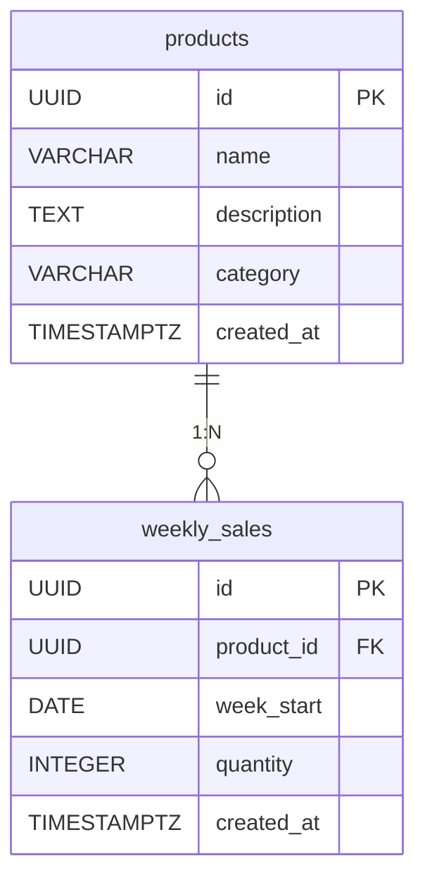

# Kaleido Scan DB設計書

## 基本方針

- RDBMS: PostgreSQL
- ローカル: Docker コンテナ上で動作
- 本番: AWS RDS (PostgreSQL)
- UUIDは `gen_random_uuid()` で自動生成（pgcrypto 拡張 or PostgreSQL 13+）
- タイムスタンプはすべて `TIMESTAMPTZ`（UTC）で保持

---

## ER図



---

## テーブル定義

### products（商品マスタ）

| カラム | 型 | 制約 | 説明 |
|--------|-----|------|------|
| `id` | `UUID` | `PK DEFAULT gen_random_uuid()` | 商品ID（※後述） |
| `name` | `VARCHAR(100)` | `NOT NULL UNIQUE` | 商品名（AI識別結果と照合するキー） |
| `description` | `TEXT` | | 商品説明（チーム手動記入） |
| `category` | `VARCHAR(50)` | `NOT NULL` | カテゴリ（後述の定数値） |
| `created_at` | `TIMESTAMPTZ` | `NOT NULL DEFAULT NOW()` | 作成日時 |

**category の定数値**

| 値 | 意味 |
|----|------|
| `food` | 食べ物（おにぎり含む） |
| `drink` | 飲み物 |
| `snack` | お菓子 |

> **UUID について**: UUID（36文字）は分散システムでのID衝突回避が目的。5商品固定のこの規模では `SERIAL`（連番整数）の方がシンプルだが、将来的な商品追加・外部連携時の安全性を考慮してUUIDを採用。シードデータは `11111111-...` のような分かりやすい固定値で統一する。

```sql
CREATE TABLE products (
    id          UUID        PRIMARY KEY DEFAULT gen_random_uuid(),
    name        VARCHAR(100) NOT NULL UNIQUE,
    description TEXT,
    category    VARCHAR(50)  NOT NULL,
    created_at  TIMESTAMPTZ  NOT NULL DEFAULT NOW()
);
```

---

### weekly_sales（週次売上記録）

| カラム | 型 | 制約 | 説明 |
|--------|-----|------|------|
| `id` | `UUID` | `PK DEFAULT gen_random_uuid()` | レコードID |
| `product_id` | `UUID` | `NOT NULL REFERENCES products(id)` | 商品ID |
| `week_start` | `DATE` | `NOT NULL` | 週の開始日（月曜日） |
| `quantity` | `INTEGER` | `NOT NULL CHECK (quantity >= 0)` | 週間売上個数 |
| `created_at` | `TIMESTAMPTZ` | `NOT NULL DEFAULT NOW()` | レコード作成日時 |

**制約**

- `UNIQUE(product_id, week_start)` — 同一商品×同一週のレコードは1件のみ

```sql
CREATE TABLE weekly_sales (
    id          UUID    PRIMARY KEY DEFAULT gen_random_uuid(),
    product_id  UUID    NOT NULL REFERENCES products(id),
    week_start  DATE    NOT NULL,
    quantity    INTEGER NOT NULL CHECK (quantity >= 0),
    created_at  TIMESTAMPTZ NOT NULL DEFAULT NOW(),
    UNIQUE (product_id, week_start)
);

CREATE INDEX idx_weekly_sales_product_id ON weekly_sales(product_id);
CREATE INDEX idx_weekly_sales_week_start ON weekly_sales(week_start);
```

---

## 主要クエリ

### 売上ランキング（全期間累計）

```sql
SELECT
    p.id,
    p.name,
    p.description,
    p.category,
    SUM(ws.quantity) AS total_quantity,
    RANK() OVER (ORDER BY SUM(ws.quantity) DESC) AS rank
FROM products p
JOIN weekly_sales ws ON p.id = ws.product_id
GROUP BY p.id, p.name, p.description, p.category;
```

### 急上昇ランキング（直近1週 vs 前週の増加率）

**前週比の計算式:**

```
前週比(%) = 今週の売上 ÷ 先週の売上 × 100
```

例: 先週1,300個 → 今週1,700個の場合、前週比 = 1700 ÷ 1300 × 100 ≒ **130.8%**（先週の1.3倍）

前週比が高い商品ほど上位になり、オーラが強くなる。先週データがない商品は先週売上 = 0 として扱うため、分母がゼロになり `NULL` → `NULLS LAST` で最下位扱い。

```sql
WITH latest_week AS (
    SELECT MAX(week_start) AS w FROM weekly_sales
),
current_week AS (
    SELECT product_id, quantity
    FROM weekly_sales, latest_week
    WHERE week_start = latest_week.w
),
prev_week AS (
    SELECT product_id, quantity
    FROM weekly_sales, latest_week
    WHERE week_start = latest_week.w - INTERVAL '7 days'
)
SELECT
    p.id,
    p.name,
    p.category,
    cw.quantity AS current_quantity,
    COALESCE(pw.quantity, 0) AS prev_quantity,
    ROUND(
        cw.quantity::NUMERIC
        / NULLIF(COALESCE(pw.quantity, 0), 0) * 100,
        1
    ) AS growth_rate
FROM products p
JOIN current_week cw ON p.id = cw.product_id
LEFT JOIN prev_week pw ON p.id = pw.product_id
ORDER BY growth_rate DESC NULLS LAST;
```

### 商品1件のランキングを取得

```sql
SELECT
    rank,
    total_quantity
FROM (
    SELECT
        p.id,
        SUM(ws.quantity) AS total_quantity,
        RANK() OVER (ORDER BY SUM(ws.quantity) DESC) AS rank
    FROM products p
    JOIN weekly_sales ws ON p.id = ws.product_id
    GROUP BY p.id
) ranked
WHERE id = $1;
```

---

## シードデータ（seed.sql）

MVP対象の5商品と複数週分のダミー売上データを投入する。

### 商品マスタ

```sql
INSERT INTO products (id, name, description, category) VALUES
    ('11111111-1111-1111-1111-111111111111', '味付海苔　炭火焼紅しゃけ',       '炭火で香ばしく焼き上げた紅しゃけを中の具にした手巻おにぎり。パリッとした海苔を巻いて食べる。', 'food'),
    ('22222222-2222-2222-2222-222222222222', '味付海苔　ツナマヨネーズ',         'ツナをコク深いマヨネーズで和えて中の具にした手巻おにぎり。パリッとした海苔を巻いて食べる。',   'food'),
    ('33333333-3333-3333-3333-333333333333', 'ブラックコーヒー 500ml',          'ブラックコーヒー本来の飲みごたえと香り豊かで飲みやすい味わいを両立した無糖ブラックコーヒー。', 'drink'),
    ('44444444-4444-4444-4444-444444444444', 'オレンジ 500ml',                 '大人も子供もゴクゴク飲めるすっきりした味わい。果実の味を楽しめるオレンジの低果汁飲料。',     'drink'),
    ('55555555-5555-5555-5555-555555555555', 'セブンプレミアム アーモンドボール', 'アーモンドをホワイトチョコレートでコーティングしたひとくちサイズのスナック。香ばしいアーモンドとチョコレートの絶妙な組み合わせ。',                              'snack');
```

### 週次売上データ（直近6週分）

```sql
-- week_start は月曜日の日付で記録する
-- 数値は仮のダミーデータ
INSERT INTO weekly_sales (product_id, week_start, quantity) VALUES
    -- 味付海苔 炭火焼紅しゃけ（売上1位）
    ('11111111-1111-1111-1111-111111111111', '2026-02-02', 2100),
    ('11111111-1111-1111-1111-111111111111', '2026-02-09', 2200),
    ('11111111-1111-1111-1111-111111111111', '2026-02-16', 2050),
    ('11111111-1111-1111-1111-111111111111', '2026-02-23', 2300),
    ('11111111-1111-1111-1111-111111111111', '2026-03-02', 2100),
    ('11111111-1111-1111-1111-111111111111', '2026-03-09', 2250),

    -- 味付海苔 ツナマヨネーズ（売上2位）
    ('22222222-2222-2222-2222-222222222222', '2026-02-02', 1800),
    ('22222222-2222-2222-2222-222222222222', '2026-02-09', 1850),
    ('22222222-2222-2222-2222-222222222222', '2026-02-16', 1900),
    ('22222222-2222-2222-2222-222222222222', '2026-02-23', 1750),
    ('22222222-2222-2222-2222-222222222222', '2026-03-02', 1900),
    ('22222222-2222-2222-2222-222222222222', '2026-03-09', 1950),

    -- ブラックコーヒー 500ml（売上3位）
    ('33333333-3333-3333-3333-333333333333', '2026-02-02', 1600),
    ('33333333-3333-3333-3333-333333333333', '2026-02-09', 1550),
    ('33333333-3333-3333-3333-333333333333', '2026-02-16', 1650),
    ('33333333-3333-3333-3333-333333333333', '2026-02-23', 1700),
    ('33333333-3333-3333-3333-333333333333', '2026-03-02', 1620),
    ('33333333-3333-3333-3333-333333333333', '2026-03-09', 1580),

    -- オレンジ 500ml（売上4位・急上昇例）
    ('44444444-4444-4444-4444-444444444444', '2026-02-02',  900),
    ('44444444-4444-4444-4444-444444444444', '2026-02-09',  950),
    ('44444444-4444-4444-4444-444444444444', '2026-02-16', 1000),
    ('44444444-4444-4444-4444-444444444444', '2026-02-23', 1100),
    ('44444444-4444-4444-4444-444444444444', '2026-03-02', 1300),
    ('44444444-4444-4444-4444-444444444444', '2026-03-09', 1700),  -- 急上昇

    -- セブンプレミアム アーモンドボール（売上5位）
    ('55555555-5555-5555-5555-555555555555', '2026-02-02',  800),
    ('55555555-5555-5555-5555-555555555555', '2026-02-09',  820),
    ('55555555-5555-5555-5555-555555555555', '2026-02-16',  790),
    ('55555555-5555-5555-5555-555555555555', '2026-02-23',  810),
    ('55555555-5555-5555-5555-555555555555', '2026-03-02',  800),
    ('55555555-5555-5555-5555-555555555555', '2026-03-09',  830);
```

> **オレンジ 500ml の急上昇について**: 直近2週で急増しているダミーデータを意図的に設計。「急上昇モード」実装時のデモデータとして機能する。

---

## マイグレーション方針

- マイグレーションファイルは `db/migrations/` に連番で管理
- 形式: `0001_create_products.sql`, `0002_create_weekly_sales.sql`
- ロールバック用の `down` ファイルも用意する

---

## シードデータの投入方針

- シードデータは `backend/database/seed.go` に Go コードとして実装する
  - 既存の DB 接続設定を再利用でき、アプリと同じビルドに含められるため
  - SQL ファイルとは異なりコンパイル時に型チェックが効く
- `main.go` で `--seed` フラグを受け取り、起動時に `database.Seed(db)` を呼ぶ形で実行する
- 冪等性を保つため `ON CONFLICT` を使用する
  - `products`: `ON CONFLICT (id) DO UPDATE SET` — マスタデータ変更時にコードの変更だけで反映できるよう上書き更新する
  - `weekly_sales`: `ON CONFLICT (product_id, week_start) DO NOTHING` — 売上履歴は一度投入したら変更しない
- 投入データの内容は上記「シードデータ（seed.sql）」セクションの値をそのまま使用する
